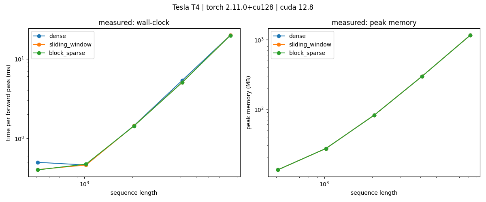
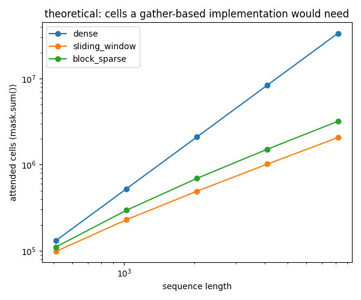
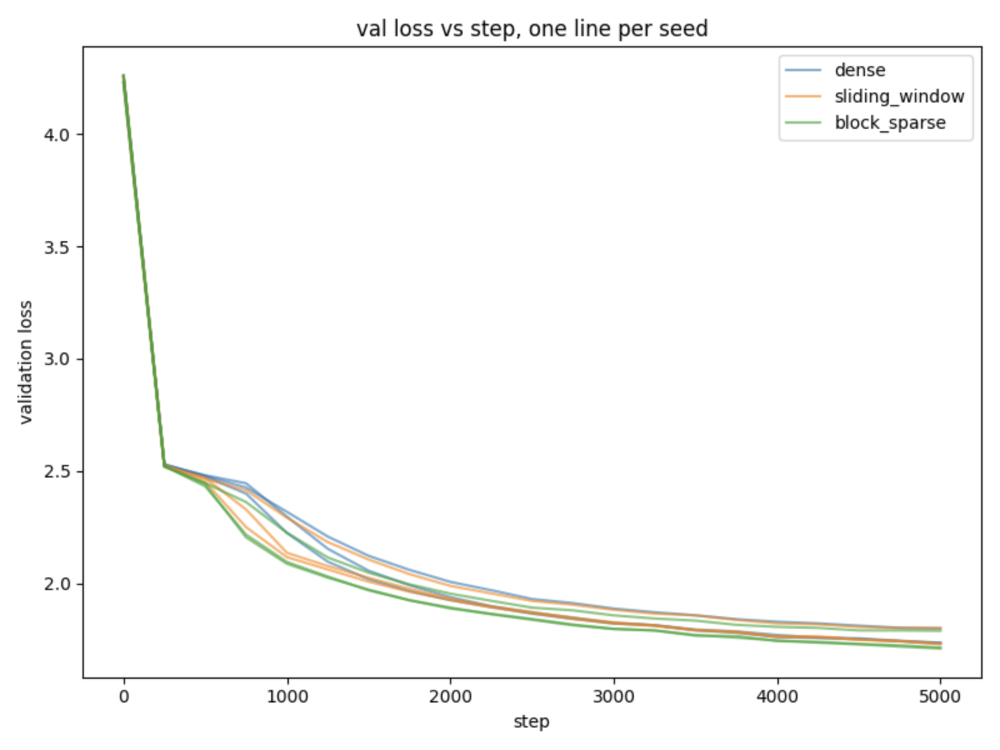

# sparse-attention-from-scratch

Dense and sparse self-attention written by hand in PyTorch — no `F.scaled_dot_product_attention`,
no attention library — with a correctness harness, a benchmark across sequence lengths, and a
quality comparison on a small character-level GPT.

This is my submission for the Postman AI/ML recruitment task (Task 1: Sparse Attention from
Scratch).

## The short version of what I found

Full attention compares every token against every other token, so cost grows with the square of
sequence length. Sparse attention restricts which pairs get compared. I implemented two patterns
and measured what they actually buy you.

Three things came out of it:

**Masking gives you sparse behaviour but none of the savings.** At sequence length 8192 all three
patterns used exactly the same peak memory — 1155.67 MB, identical to three decimal places — even
though the sliding window only needs 6.2% of the cells. The reason is the order of operations: the
matmul computes and allocates the whole n×n grid, and only then does the mask overwrite entries
with `-inf`. You pay for everything and throw most of it away. Real savings need an implementation
that never computes the skipped cells at all.

**Halving the information a token can see cost almost nothing.** Sliding window with a 76-wide
window sees 64.9 cells per row on average against dense's 128.5, and ended up at essentially the
same validation loss (1.7548 vs 1.7573 averaged over three seeds). Predicting the next character
is a local job — you don't need to look back 128 characters to guess the next letter.

**Block-sparse beat dense, which I did not expect.** Averaged over three seeds, block-sparse
reached 1.7387 against dense's 1.7573, and it was ahead in all three seeds. I had assumed this was
impossible, since dense has strictly more information available. More on that below, including why
I don't think it's a bug and why I also can't claim it's significant.

## Status

- [x] 1.1 Manual dense attention (matmul → mask → softmax → matmul)
- [x] 1.2 Sliding-window sparsity pattern
- [x] 1.2 Block-sparse (BigBird-style: local + global + random)
- [x] 1.3 Correctness harness
- [x] 1.4 NaN handling for fully-masked query rows
- [x] 1.5 Benchmark: wall-clock + peak memory, 512 → 8192
- [x] 1.6 Quality evaluation: 2-layer char-level GPT on TinyShakespeare
- [ ] 1.7 Writeup

## Setup

```bash
git clone https://github.com/VeerR13/Sparse-Attention-from-Scratch.git
cd Sparse-Attention-from-Scratch
pip install -r requirements.txt
```

## Running

```bash
pytest tests/                 # correctness harness, 5 tests
python scripts/benchmark.py   # writes results/benchmark.csv and two plots
python scripts/train.py       # runs all 3 patterns x 3 seeds, writes results/quality.csv
```

`train.py` takes no arguments — it loops over the patterns and seeds internally. It downloads
TinyShakespeare on first run into `data/`, which is gitignored.

Both scripts need a GPU to be meaningful. `torch.cuda.max_memory_allocated()` silently returns 0
on CPU, so the benchmark's memory column is useless without one. I ran the benchmark on a Colab
T4 and the training on a Kaggle T4.

## Layout

```
src/attention.py       dense attention: matmul, mask, softmax, matmul
src/masks.py           causal, sliding-window and block-sparse mask builders
src/model.py           2-layer single-head character-level GPT
tests/                 correctness harness
scripts/benchmark.py   wall-clock and peak memory vs sequence length
scripts/train.py       TinyShakespeare training and quality comparison
results/               raw numbers and plots
NOTES.md               working notes as I went
```

## The one design decision worth knowing about

`dense_attention` takes the mask as an **argument** instead of building a causal mask inside
itself, which is what most tutorial implementations do.

That sounds like a small thing but it's what makes the whole comparison work. Every sparsity
pattern is just a different boolean grid handed to the same function, so all three patterns run
through one implementation that's been verified against PyTorch's own kernel. When dense and
sparse outputs differ, the difference has to come from the mask, because there is no other code
path it could have come from. If I'd written three separate attention functions instead, a
difference in results could have meant the pattern was worse *or* that one of the three
implementations had a bug, and I'd have no way to tell which.

Everything else in the repo follows from that: `masks.py` only produces boolean grids, and
`attention.py` never knows which pattern it's running.

## Benchmark results

Tesla T4, torch 2.11.0+cu128, CUDA 12.8. Forward pass only, batch 1, 1 head, head_dim 64, so
sequence length is the only thing changing. Warmup pass then 8 repeats, median reported. Masks are
built outside the timed region.

| Seq length | Dense (ms) | Sliding window (ms) | Block-sparse (ms) | Peak memory (MB) |
|-----------:|-----------:|--------------------:|------------------:|-----------------:|
| 512        | 0.498      | 0.404               | 0.400             | 13.37            |
| 1024       | 0.461      | 0.460               | 0.473             | 27.13            |
| 2048       | 1.446      | 1.437               | 1.432             | 81.40            |
| 4096       | 5.355      | 5.063               | 5.044             | 296.88           |
| 8192       | 19.838     | 19.777              | 19.715            | 1155.67          |

Memory gets one column because it was **identical for all three patterns** at every length. That's
the finding, not a formatting shortcut.



Three lines drawn exactly on top of each other. Only the last one plotted is visible.

The n=512 row is the odd one out — sparse looks about 19% faster there. I don't believe it. The
whole forward pass is 0.4 ms at that size, which is small enough that kernel launch overhead
dominates, and the first configuration measured pays extra warmup. At every larger size the three
patterns agree to within 1%, which is what you'd expect given they do identical work.

Memory scaling converges on quadratic as the grid starts to dominate:

```
 512 → 1024   ×2.03
1024 → 2048   ×3.00
2048 → 4096   ×3.65
4096 → 8192   ×3.89      (×4 would be perfectly quadratic)
```

The early ratios fall short of 4 because at small sequence lengths the q/k/v tensors and allocator
overhead are a decent fraction of the total. By 8192 the score grid dominates and you can see the
n² behaviour clearly.

### What the patterns would cost if they were implemented properly

Since the measured plot shows nothing, I also counted how many cells each mask actually allows.
That's what a gather-based implementation would compute, and it's one `mask.sum()` per point.

| Seq length | Dense cells | Sliding window | Block-sparse | Window as % of dense |
|-----------:|------------:|---------------:|-------------:|---------------------:|
| 512        | 131,328     | 98,432         | 110,848      | 75.0%                |
| 1024       | 524,800     | 229,504        | 295,424      | 43.7%                |
| 2048       | 2,098,176   | 491,648        | 693,248      | 23.4%                |
| 4096       | 8,390,656   | 1,015,936      | 1,513,472    | 12.1%                |
| 8192       | 33,558,528  | 2,064,512      | 3,186,688    | 6.2%                 |



These lines do diverge, which is the whole point. Sliding window falls from 75% of dense to 6.2%
and keeps dropping.

Putting the two figures together: at 8192 the measured peak memory is 1155.67 MB for every
pattern, but sliding window only needs 6.2% of the cells. A gather-based implementation would need
roughly 71 MB. So about **16× of memory is being paid for and discarded**, and that gap is the
entire distance between what I built and what sparse attention is supposed to deliver.

## Quality results

2-layer single-head character-level GPT, 446k parameters, d_model 128, context length 256,
TinyShakespeare, 5000 steps, Adam at 3e-4. Three seeds per pattern. Within a seed, all three
patterns get identical model initialisation and identical batch order — the mask is the only thing
that differs.

The two sparse patterns are tuned to nearly the same information budget so the comparison is about
pattern shape rather than one of them simply getting more to look at.

| Pattern | Params | Mean cells/row | Val loss (3 seeds) | Mean |
|---------|--------|---------------:|--------------------|-----:|
| Dense | causal | 128.5 | 1.7351 / 1.7364 / 1.8005 | 1.7573 |
| Sliding window | window=76 | 64.87 | 1.7302 / 1.7320 / 1.8022 | 1.7548 |
| Block-sparse | block=16, global=1, random=2 | 63.5–66.5 | 1.7151 / 1.7112 / 1.7898 | 1.7387 |



Block-sparse's cells-per-row is a range because its random blocks are redrawn per seed, so its
mask genuinely differs between runs. The other two are deterministic.

### Reading the numbers

The seed effect is bigger than anything else here. Dense alone ranges from 1.7351 to 1.8005 across
seeds, a spread of 0.065, while the gap between dense and block-sparse is 0.019 — about 3.5×
smaller. Seed 2 was a bad run for all three patterns. If I'd compared one dense run against one
sparse run without pairing them, the result would have been unreadable noise, and the paired design
is the only reason there's anything to say.

Comparing per seed instead of per pattern average:

```
sliding_window vs dense:  -0.0049,  -0.0044,  +0.0017    (sign flips, so: no effect)
block_sparse   vs dense:  -0.0200,  -0.0252,  -0.0107    (consistent, mean -0.0186)
block_sparse   vs sliding_window:  -0.0151, -0.0208, -0.0124   (consistent, mean -0.0161)
```

Sliding window matched dense. Block-sparse beat both, in every seed.

### On block-sparse beating dense

My training script prints a warning when a sparse pattern beats dense, because I assumed that
couldn't legitimately happen — sparse has strictly less information available. The warning fired.
I went looking for the bug and didn't find one.

What I checked: the mask does reach the model (outputs are identical for the first 64 positions
and start diverging at exactly position 64 with a 64-wide window, which is where it should),
initialisation and batch order are identical across patterns within a seed, and evaluation uses the
same mask as training.

What I think is actually going on is that the gain comes from **global tokens rather than from
sparsity**. Sliding window is purely local and matched dense. Block-sparse adds global blocks and
random blocks on top of a local window, at the same budget, and beat it. The only structural
difference between my two sparse patterns is those global and random connections, so that's where
the improvement has to be coming from. A global block gives every position a routing hub for free;
dense has to learn to build one.

The loss curves support this. Block-sparse pulls ahead early — the gap looks like about 0.1 around
step 1000 — and by step 5000 it's down to about 0.02. The gap is narrowing, which reads as
"converges faster" rather than "is more capable." Validation loss was still falling at step 4999
for every pattern, so none of these models is near convergence, and dense's information advantage
may simply not have had time to pay off.

I can't claim this result is significant. Three seeds, all pointing the same way, gives a sign test
p-value of 0.125, and the effect is smaller than the seed-to-seed spread. The honest summary is
that block-sparse was consistently ahead at this training budget, most likely because of global
tokens, and that I'd need a longer run to know whether dense eventually overtakes it.

## Limitations

Things I know are wrong or missing, rather than things I hope nobody notices.

**No gather-based implementation.** Masking is applied after the matmul, so no speed or memory
saving was demonstrated or is possible with this code. Everything in the benchmark section follows
from that.

**The correctness harness is weaker than it looks.** It compares `dense_attention` against
`dense_attention` with two different masks, so a bug inside that function would cancel on both
sides. It verifies that the two masks agree with each other, not that attention is correct —
correctness rests on the separate comparison against PyTorch's kernel. Adding a row-0 ground-truth
assertion (under a causal mask, row 0 can only see itself, so the output must exactly equal the
first value vector) gave it an independent anchor, and I confirmed by sabotage that the suite went
from missing a mask-polarity bug to catching it. Coverage is still narrow: rows where the two masks
are identical are checked directly, which is 4 of 16 rows for sliding window and 16 of 32 for
block-sparse.

**Random blocks aren't quite what the name says.** I sample random blocks from all causally legal
blocks, including ones the local window already covers, so `num_random_blocks=2` yields fewer than
2 genuinely new connections. BigBird's reference implementation excludes window and global blocks
from the candidate pool.

**Sliding window's mask builder is a Python loop over tokens** and takes about 240 ms at sequence
length 8192. It's built outside the timed region so it doesn't pollute the benchmark, but it's slow.
The block-sparse builder loops over blocks instead and doesn't have this problem.

**The NaN case is unreachable in my patterns.** Both always keep the diagonal, so no row can ever
be fully masked. That wasn't a deliberate defence — it just follows from the natural way to build a
window or a block. `sliding_window_mask(n, 0)` is the live reproduction case. The most common
real-world cause, padded sequences in a batch, never arises here.

**The quality runs are undertrained.** Validation loss was still dropping at step 4999 for all
three patterns, so these are not converged numbers and the ordering could change with a longer run.

**Three seeds is not many** for an effect this small.

**Single head, and Post-LN.** The brief asks for a 2-layer character-level GPT and doesn't require
multi-head, so I used one head to keep the shape handling simple. The block puts layer norm after
the residual add, which is the original Transformer arrangement rather than GPT-2's; at two layers
it trained without trouble.

## References

- Vaswani et al., [Attention Is All You Need](https://arxiv.org/abs/1706.03762) — section 3.2 is
  the scaled dot-product attention this is built on
- Beltagy et al., [Longformer](https://arxiv.org/abs/2004.05150) — sliding window attention
- Zaheer et al., [Big Bird](https://arxiv.org/abs/2007.14062) — local + global + random blocks
- HuggingFace, [Understanding BigBird's Block Sparse Attention](https://huggingface.co/blog/big-bird)
  — what I actually checked my block-sparse implementation against
